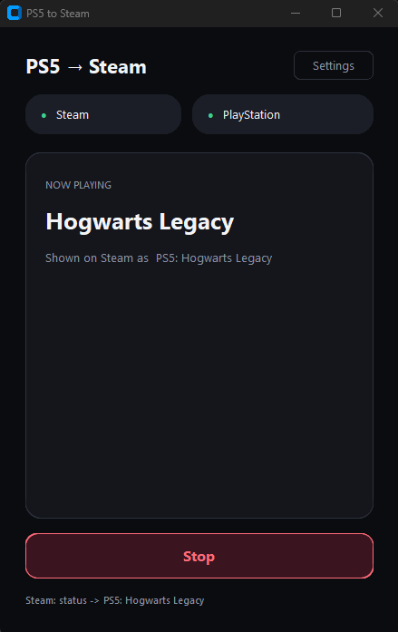
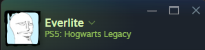

# PS5 to Steam Bridge

Your current PS5 game, on Steam — as `PS5: Hogwarts Legacy`.

<p align="center">
  
</p>

<p align="center">
  
</p>

The app polls PlayStation presence and sets a custom Steam game name. Stop or quit and the status is cleared.

| | |
| --- | --- |
| PlayStation | NPSSO token, stored only on this PC (encrypted on Windows) |
| Steam | One-time login, then a saved session |
| Windows | One EXE, no Python/Node for others |
| Linux | Run from source |

Settings live in `%APPDATA%\PS5-to-Steam-Bridge` on Windows and `~/.local/share/PS5-to-Steam-Bridge` on Linux. Replacing the EXE does not log you out.

On Windows, NPSSO and Steam tokens are DPAPI-encrypted (`secrets.bin`). `config.json` only keeps the Steam account name. An older plaintext config is migrated on first start.

## Use it

1. Open **Settings** and sign in with your Steam *account name* (not the profile name). Steam Guard once, then the session is reused.
2. Log in at [playstation.com](https://www.playstation.com/), open the [token page](https://ca.account.sony.com/api/v1/ssocookie), paste the `npsso` value (or the whole JSON), **Verify**.
3. Back on Home, hit **Start**.

## Windows EXE

Build PC needs Python 3.11+ (`Add to PATH`). The script creates the venv and downloads pinned Node `v22.18.0` (SHA256-checked). Recipients need neither.

```powershell
.\build_exe.bat
```

Result: `dist\PS5-to-Steam-Bridge.exe` — that file is the whole app. First launch can take a few seconds while it unpacks.

## Run from source

Python 3.11+, Node 18+, Tk (Linux: `python3-tk`).

```powershell
py -3 -m venv .venv
.\.venv\Scripts\python -m pip install -r requirements.txt
cd steam-backend && npm install && cd ..
.\.venv\Scripts\python main.py
```

```bash
sudo apt install python3-venv python3-tk nodejs npm
python3 -m venv .venv
.venv/bin/python -m pip install -r requirements.txt
cd steam-backend && npm install && cd ..
.venv/bin/python main.py
```

## Friends seeing you go online

Yes, that is normal.

This app logs into Steam as a second client and sets you **Online** plus the custom game. Friends get the usual “came online” / “now playing” updates. The official Steam friends list can also flicker for a moment while Steam resyncs presence.

Invisible or Offline in the Steam client is overwritten while the bridge is connected. Stop the bridge or quit the app to clear the game and drop that extra session.

## Security

Do not commit `config.json`, `secrets.bin`, `secrets.json`, `steam_session/`, or the AppData / XDG folder.

If something leaked: change your Steam password, sign out other devices, replace the NPSSO token.

## Develop

```powershell
.\.venv\Scripts\python -m pip install -r requirements.txt -r requirements-dev.txt
.\.venv\Scripts\python -m pytest
.\.venv\Scripts\python -m ruff check .
```

## Layout

- `main.py` — GUI and orchestration
- `psn.py` — PlayStation auth and presence
- `credstore.py` — config + encrypted tokens
- `bridge_util.py` — NPSSO / presence helpers
- `steam-backend/` — Steam worker
- `v1/` — old ASF-based version
